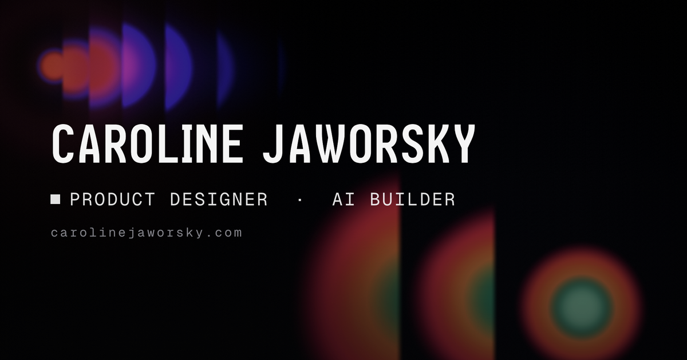

# Caroline Jaworsky - Portfolio

My personal portfolio: a product designer & AI builder who turns early concepts
into launch-ready products.

**Live → [carolinejaworsky.com](https://carolinejaworsky.com)**



---

## What's inside

- **A hand-coded WebGL hero**, soft, diffused colour orbs drifting over a glowing
  gradient field, written in custom shaders (GLSL). Holographic, moody, alive.
- **An interactive showcase** of selected work that expands as you explore it:
  - **Case studies** (research, design, measurable impact):
    - **Wiki Whisperer V2** - designing a second AI brain for an energy call centre (E.ON Next)
    - **Cog ADHD** - research & strategy for an ADHD therapy product
    - **AI design system** - a brand and reusable component library for E.ON Next's AI products
  - **Things I've built** (designed, coded, and shipped end to end):
    - **synapse** - a memory-first AI reflection agent on knowledge graphs + agentic RAG (LangChain × SurrealDB)
    - **vector** - an AI-native platform that makes B2B SaaS onboarding effortless on both sides
- **Career highlights, a toolkit, and an about section**, tied together with
  smooth-scroll choreography.

## How it's built

A deliberately over-engineered playground for the craft.

| Layer | Tech |
|------|------|
| Framework | [Next.js 16](https://nextjs.org) (App Router) · React 19 · TypeScript |
| 3D / WebGL | [React Three Fiber](https://r3f.docs.pmnd.rs) · drei · postprocessing · custom GLSL |
| Motion | [GSAP](https://gsap.com) (ScrollTrigger) · [Motion](https://motion.dev) |
| Smooth scroll | [Lenis](https://lenis.darkroom.engineering) |
| Styling | [Tailwind CSS v4](https://tailwindcss.com) (CSS-first `@theme` tokens) |
| Performance | [detect-gpu](https://github.com/pmndrs/detect-gpu) tiering + reduced-motion fallbacks |
| Tooling | Playwright (visual capture) · ESLint · Vercel |

### A system, not one-off pages

- **One source of truth for the look**, colours, type, spacing, and glass surfaces
  live as reusable design tokens (`DESIGN.md` + Tailwind `@theme`), so the whole site
  stays visually consistent.
- **Case-study templates**, a shared kit of layout primitives and motion (scroll
  reveals, parallax, streaming text, the glass hero transition) that every case study
  is assembled from, each with its own colour identity.
- **A custom case-study authoring tool**, I built an AI skill that encodes my
  writing structure and tone of voice (learned from my previous case studies), so a
  new project can be scaffolded from raw notes and assets into a structured,
  on-brand page.

## Run it locally

```bash
npm install
npm run dev      # http://localhost:3000
```

```bash
npm run build    # production build
npm run lint     # eslint
```

---

Designed by me, and shipped mostly with the help of AI.

© Caroline Jaworsky
